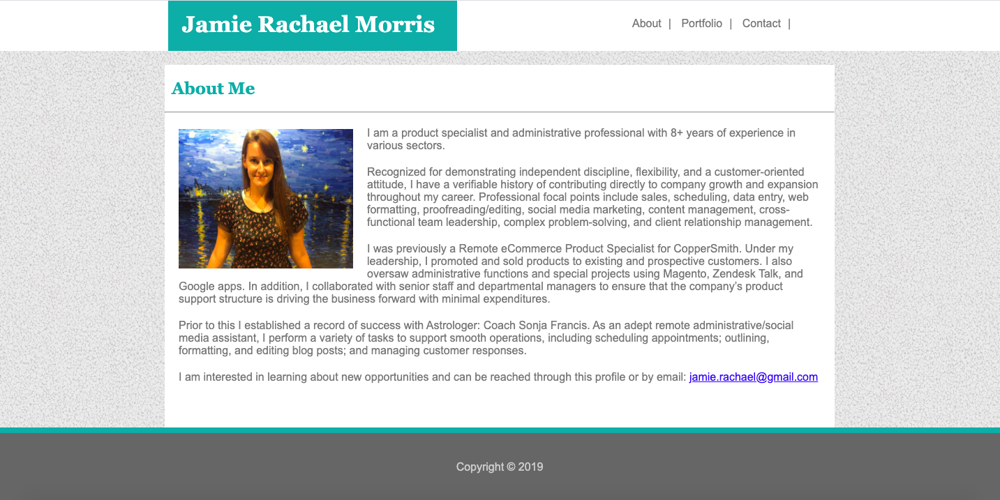
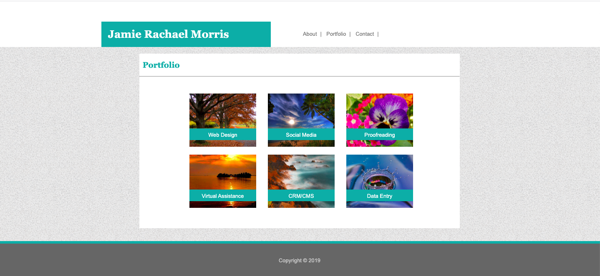
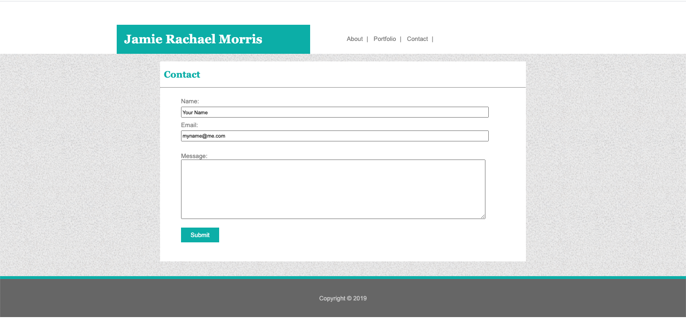

# Basic-Portfolio

This project emphasizes building a professional portfolio site using HTML/CSS

## Getting Started

This project has been deployed to GitHub Pages. To get this project up and running, you can follow the deployment link. Or, download the sources files to use this as a template.

* [GitHub Repository](https://github.com/jamierachael/Basic-Portfolio/)
* [Deployed GitHub IO](https://jamierachael.github.io/Basic-Portfolio/)
* [Full Demo Video](https://drive.google.com/file/d/1IWdYEIIzhd03a0a5fA7gwH2V2at-nsyq/view)


These instructions will get you a copy of the project up and running on your local machine for development and testing purposes. See deployment for notes on how to deploy the project on a live system.

### Prerequisites

To install this application, you will need a text editor. I recommend Visual Studio Code. 

### Installing

To install this code, download the zip file, or use GitHub's guidelines to clone the repository. 


## Projecy Requirement 

This project provides a basic template for a portfolio website. 

```
Pages include the following: Index, Portfolio, Contact. 

### Index

Contains About Me information.



### Portfolio

Provides a gallery style directory that can link to projects. 



### Contact

Contains a form to submit contact information. 



## Authors

* **Jamie Rachael Morris** - *Initial work* - [PurpleBooth](https://github.com/jamierachael)

## License

## Acknowledgments

* Hat tip to UNH for providing project parameters and code examples


